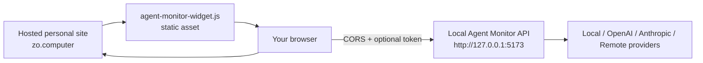

# Hosted Personal-Site Embed

This guide covers embedding Agent Monitor on a hosted personal site, such as `https://zo.computer`, while the Agent Monitor API keeps running locally on your computer.

## Deployment Model



The hosted site serves the widget script. The browser loads that script and calls the local Agent Monitor API from the same machine. The hosted site does not need to store provider API keys or run an Agent Monitor backend.

## Site Snippet

Copy `embed/agent-monitor-widget.js` into your site's static assets, for example `/assets/agent-monitor-widget.js`, then render:

```html
<agent-monitor-widget
  api-base="http://127.0.0.1:5173"
  api-token="replace-with-your-local-widget-token"
  refresh-ms="15000"
></agent-monitor-widget>
<script src="/assets/agent-monitor-widget.js"></script>
```

If your site prefers bearer auth headers, use:

```html
<agent-monitor-widget
  api-base="http://127.0.0.1:5173"
  api-token="replace-with-your-local-widget-token"
  auth-header="authorization"
  refresh-ms="15000"
></agent-monitor-widget>
<script src="/assets/agent-monitor-widget.js"></script>
```

## Local Agent Monitor Setup

Run Agent Monitor locally:

```sh
npm run start
```

Configure trusted origins and a widget token from the app Settings panel, or in `agent-monitor.config.json`:

```json
{
  "apiToken": "replace-with-a-long-random-token",
  "allowedOrigins": [
    "https://zo.computer",
    "https://your-personal-site.example"
  ],
  "snapshotRefresh": {
    "enabled": true,
    "intervalMs": 15000
  }
}
```

The public config API only reports whether a token exists; it does not return the token. Provider API keys and local agent environment variables are also hidden from public config responses.

## Runtime Behavior

- If `api-base` is reachable, the widget reads `/api/snapshot` and sends lifecycle actions to `/api/agents/:id/actions`.
- If the API is unreachable, the widget renders an empty fallback state so the hosted page still loads cleanly without showing fake agents.
- If the API is reachable but rejects an action, the widget shows the rejection and does not mutate local fallback state.
- `refresh-ms` is clamped between 5000 and 300000 ms.
- The widget reacts to changes in `api-base`, `api-token`, `auth-header`, and `refresh-ms` without remounting.

## Browser Security Notes

Browsers may restrict `http://127.0.0.1` requests from some hosted HTTPS contexts depending on browser policy and site headers. Agent Monitor answers CORS preflight requests for configured `allowedOrigins`, but the browser still makes the final mixed-content or private-network decision.

Practical options:

- Use the hosted widget from a browser that allows localhost/private-network requests for the site.
- Keep `apiToken` configured when allowing any cross-origin site to call the local API.
- Avoid `allowedOrigins: ["*"]` except for short local experiments.
- For public screenshots or portfolio pages, point `api-base` at a real Agent Monitor instance or omit it to show the empty fallback state.

## Quick Checks

With Agent Monitor running locally:

```sh
curl http://127.0.0.1:5173/api/health
curl -I http://127.0.0.1:5173/embed/agent-monitor-widget.js
```

Then open your hosted page and check the widget source summary. A live connection shows current snapshot freshness, provider/source health, and active-discovery state.
