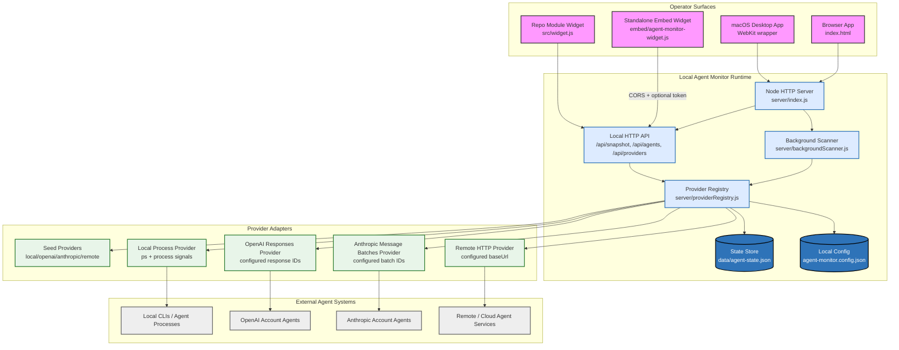
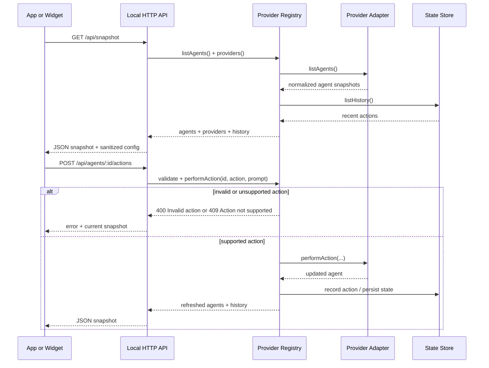
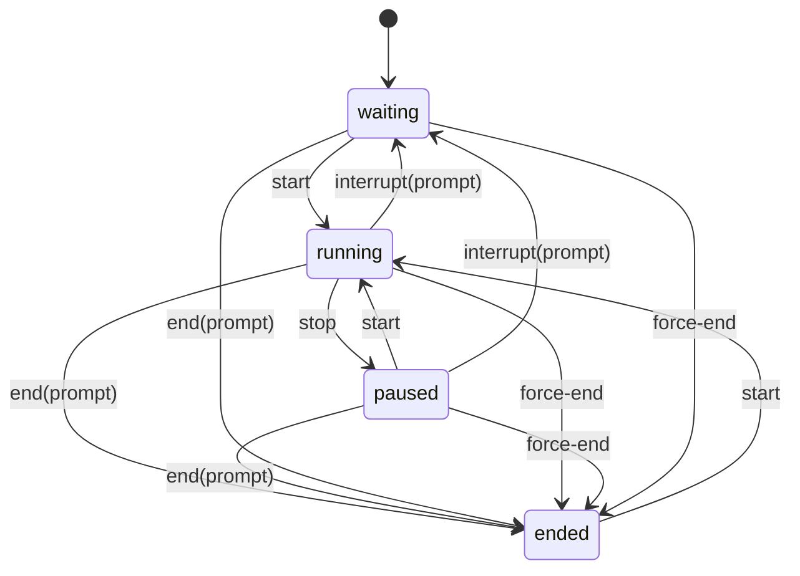

# Project Design: Agent Monitor

Agent Monitor is a local-first task manager for AI agents. The core goals are: 1. run as a standalone desktop app, browser web app, or embeddable widget; 2. integrate agents from local processes, personal provider accounts, and remote/cloud systems; 3. let operators inspect agent state, resource usage, and parent/child relationships; 4. expose task-manager lifecycle controls: start, stop, interrupt with prompt, end with prompt, and force end; 5. keep the project in `~/agent-monitor/` with git and a GitHub remote.

## 1. System Design Diagram



## 2. Requirements

### Functional Requirements

- **Run modes:** Agent Monitor must run as a local desktop app, local browser app, and embeddable widget.
- **Multiple sources:** It must integrate local agents, agents in personal provider accounts, and remote/cloud agents.
- **Lifecycle control:** Operators must be able to start, stop, interrupt with prompt, end with prompt, and force end agents.
- **Task-manager data:** The UI must show status, provider, type, runtime, CPU, memory, token/cost usage, token throughput, confidence, parent/child relationships, process metadata, logs, transcripts, and recent lifecycle actions.
- **Embeddability:** A standalone widget must be hostable on external sites and able to call the local API through trusted-origin CORS plus an optional API token.
- **Persistence:** Agent snapshots and action history should survive local server restarts.
- **Repository:** The project lives at `~/agent-monitor/`, is tracked with git, and is pushed to the public GitHub repo at `https://github.com/NTitterton/agent-monitor`.

### Non-Functional Requirements

- **Local-first:** The app should work without a hosted backend for local monitoring.
- **Provider-extensible:** New provider integrations should plug into a small adapter contract.
- **Safe-by-default:** Cross-origin API access should be explicitly allowed by config and optionally token-gated.
- **Untrusted-provider rendering:** App and widget surfaces should escape provider-supplied text and attributes before rendering HTML.
- **Embeddable with low ceremony:** The standalone widget should work from a single script tag.
- **Testable:** Verification should be scriptable and isolated from the operator's real local state.

## 3. High-Level Design

Agent Monitor is a static web UI plus a small Node local API. The API serves the app, exposes agent/task endpoints, performs lifecycle actions through provider adapters, and persists state in a local JSON file. The desktop app is a native macOS WebKit wrapper that starts the same local Node server and opens the web UI in its own window.

The system has four major layers:

- **Surfaces:** desktop app, browser app, module widget, and standalone widget.
- **Local API:** static file server, API router, CORS/auth handling, and JSON response helpers.
- **Provider registry:** discovers configured providers, normalizes agent snapshots, caches scans, records lifecycle history, validates lifecycle actions, and routes supported actions.
- **Background scanner:** optionally refreshes provider snapshots on the configured cadence so task-manager state stays warm even when the UI is idle.
- **Provider adapters:** seed adapters, local process adapter, remote HTTP adapter, configured OpenAI Responses observer, and configured Anthropic Message Batches observer.

## 4. Core Data Flow



## 5. Provider Adapter Contract

Provider adapters are objects with this shape:

```js
{
  id,
  label,
  source,
  capabilities,
  recordsHistory,
  async listAgents() {},
  async performAction(agentId, actionId, prompt) {}
}
```

Adapters should return normalized agent objects with:

- `id`
- `name`
- `provider`
- `providerId`
- `source`
- `type`
- `status`
- `parentId`
- `task`
- `cpu`
- `memoryMb`
- `processCpu`
- `processMemoryMb`
- `childCpu`
- `childMemoryMb`
- `tokens`
- `tokensPerSecond`
- `tokenRateWindowMs`
- `tokenCountConfidence`
- `costUsd`
- `startedAt`
- `endedAt`
- `children`
- `pid`
- `parentPid`
- `childPids`
- `goToTarget`
- `goToKind`
- `capabilities`
- `logs`
- `transcript`

Capabilities are part of the action contract. Snapshot boundaries normalize capability arrays to known unique action IDs. Unknown action IDs are rejected with `400`. Valid actions outside the target agent's advertised capabilities are rejected with `409`.

## 6. Lifecycle Actions



## 7. Local Process Provider

The local process provider is configured through `agent-monitor.config.json`. It uses `ps` snapshots for PID, parent PID, descendant child PIDs, CPU, memory, command, and start time. It can start configured commands and sends process-tree signals for termination:

- `stop`, `interrupt`, `end`: `SIGTERM`
- `force-end`: `SIGKILL`

Resource totals include the matched process plus descendant processes. The normalized agent also carries `processCpu`, `processMemoryMb`, `childCpu`, and `childMemoryMb` breakdown fields. Snapshot normalization coerces these resource values to finite numbers before UI meters and task sorting. Active discovery can detect known agent CLIs even when they are not explicitly configured. On macOS, `go-to` is best-effort and activates likely Terminal, browser, or editor surfaces.

## 8. Remote HTTP Provider

Remote HTTP providers are configured by `baseUrl`. Agent Monitor calls:

- `GET {baseUrl}/agents`
- `POST {baseUrl}/agents/:id/actions`

Provider failures are isolated: `/api/providers` reports health and errors, while healthy providers continue returning agents.

Remote agents can expose the same normalized resource, lineage, log, transcript, capability, and `go-to` fields as local agents. The adapter preserves provider-reported process breakdown fields, normalizes parent/child lineage IDs to strings, and routes lifecycle actions through the remote action endpoint.

Provider snapshots can either report token throughput directly or only report cumulative tokens. The registry preserves positive provider-reported rates and otherwise derives `tokensPerSecond` from successive fresh snapshots for the same provider/agent ID. Embedded widgets include nonzero `costUsd` beside resource and token metrics so embeds keep spend visible. Snapshot normalization coerces `costUsd` to a number before UI totals and spend sorting.

## 9. OpenAI Responses Provider

The OpenAI Responses provider observes configured response IDs from a user's OpenAI account. It retrieves each response, maps status/model/token usage/output transcript into the normalized agent shape, and routes terminating lifecycle actions to OpenAI's cancel response endpoint.

This is an observer/control adapter for known response IDs, not a full account crawler. It avoids guessing at private account state that the API does not expose as an agent task list. Already-created Responses expose cancel-style capabilities but not `start`.

## 10. Anthropic Message Batches Provider

The Anthropic Message Batches provider observes configured message batch IDs from a user's Anthropic account. It retrieves each batch, maps processing status and request counts into the normalized agent shape, and routes terminating lifecycle actions to Anthropic's cancel batch endpoint.

This is also an observer/control adapter for known batch IDs, not automatic account-wide discovery. Already-created Message Batches expose cancel-style capabilities but not `start`.

## 11. Embed Security

Cross-site embeds require explicit `allowedOrigins` configuration. If `apiToken` is configured, cross-origin calls must include either:

- `Authorization: Bearer <token>`
- `X-Agent-Monitor-Token: <token>`

Same-origin local app requests continue working without embedding secrets in `index.html`.

The standalone widget prefers `/api/snapshot`, falls back to the legacy `/api/agents` shape for older local servers, and uses local in-memory fallback only when no API base is configured or the network request fails. If a reachable API rejects an action, the widget leaves its state unchanged.

Both widget implementations preserve the full snapshot for lineage lookups while rendering cards in task-pressure order: active status, provider-reported priority, CPU usage, newest start time, then name.

## 12. Verification

Verification is currently handled by:

- `npm run check`: JavaScript syntax checks across app, server, widgets, and scripts.
- `npm run smoke`: starts an isolated local server with temporary config/state and verifies static routes, API auth, CORS, snapshot responses, lifecycle actions, action validation, local process start/force-end, provider normalization, per-agent detail, and persistence.
- `npm run desktop:build`: compiles and verifies the macOS app wrapper.
- `npm run desktop:package`: builds and zips the verified macOS app bundle.

## 13. Known Gaps

- OpenAI integration currently observes configured Responses API IDs; it does not discover all account activity automatically.
- Anthropic integration currently observes configured Message Batch IDs; it does not discover all account activity automatically.
- Desktop packaging is a local macOS app bundle and zip, not a signed installer.
- Local process control is signal-based and should grow safer start/stop policies and deeper terminal-tab/window targeting.
- Account integrations observe configured OpenAI Response IDs and Anthropic Message Batch IDs; broader provider discovery depends on what those APIs expose.
