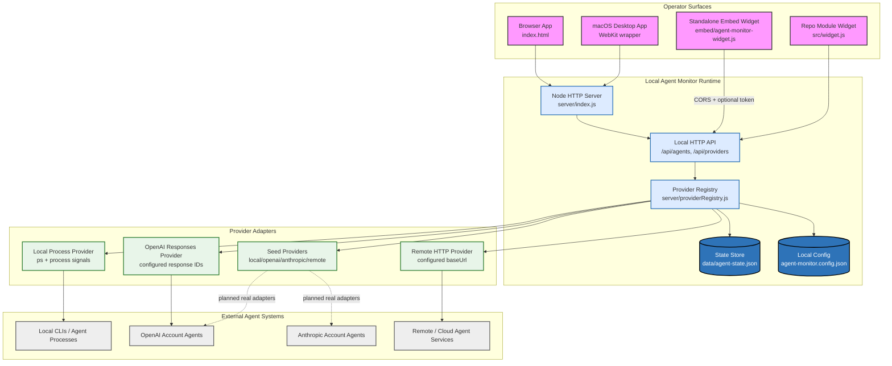
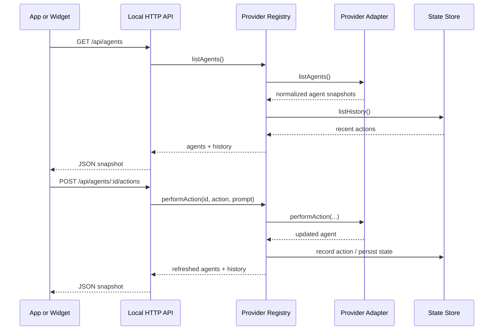
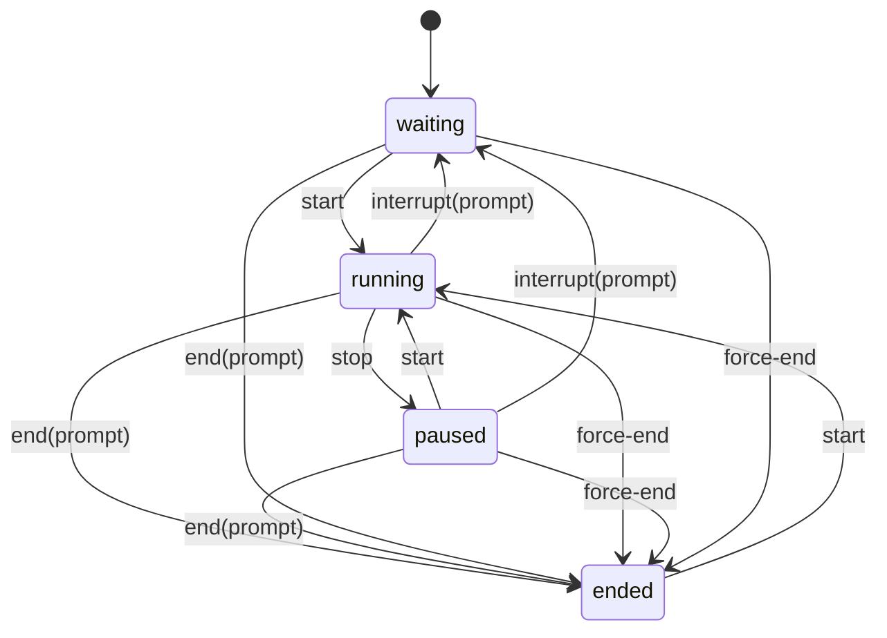

# Project Design: Agent Monitor

Agent Monitor is a local-first task manager for AI agents. The goal is to run it as a standalone desktop app, a browser web app, or an embeddable widget, while integrating agents from local processes, personal provider accounts, and remote/cloud systems. Operators should be able to inspect agent state and resource usage, understand parent/child relationships, and apply lifecycle controls: start, stop, interrupt with prompt, end with prompt, and force end.

## 1. System Design Diagram



## 2. Requirements

### Functional Requirements

- **Run modes:** Agent Monitor must run as a local desktop app, local browser app, and embeddable widget.
- **Multiple sources:** It must integrate local agents, agents in personal provider accounts, and remote/cloud agents.
- **Lifecycle control:** Operators must be able to start, stop, interrupt with prompt, end with prompt, and force end agents.
- **Task-manager data:** The UI must show status, provider, runtime, CPU, memory, token/cost usage, parent/child relationships, and recent lifecycle actions.
- **Embeddability:** A standalone widget must be hostable on external sites and able to call the local API through trusted-origin CORS plus an optional API token.
- **Persistence:** Agent snapshots and action history should survive local server restarts.
- **Repository:** The project lives at `~/agent-monitor/`, is tracked with git, and should be pushed to GitHub whenever credentials allow.

### Non-Functional Requirements

- **Local-first:** The app should work without a hosted backend for local monitoring.
- **Provider-extensible:** New provider integrations should plug into a small adapter contract.
- **Safe-by-default:** Cross-origin API access should be explicitly allowed by config and optionally token-gated.
- **Embeddable with low ceremony:** The standalone widget should work from a single script tag.
- **Testable:** Verification should be scriptable and isolated from the operator's real local state.

## 3. High-Level Design

Agent Monitor is a static web UI plus a small Node local API. The API serves the app, exposes agent/task endpoints, performs lifecycle actions through provider adapters, and persists state in a local JSON file. The desktop app is a native macOS WebKit wrapper that starts the same local Node server and opens the web UI in its own window.

The system has four major layers:

- **Surfaces:** desktop app, browser app, module widget, and standalone widget.
- **Local API:** static file server, API router, CORS/auth handling, and JSON response helpers.
- **Provider registry:** discovers configured providers, normalizes agent snapshots, records lifecycle history, and routes actions.
- **Provider adapters:** seed adapters, local process adapter, remote HTTP adapter, and configured OpenAI Responses observer.

## 4. Core Data Flow



## 5. Provider Adapter Contract

Provider adapters are objects with this shape:

```js
{
  id,
  label,
  source,
  capabilities,
  recordsHistory,
  async listAgents() {},
  async performAction(agentId, actionId, prompt) {}
}
```

Adapters should return normalized agent objects with:

- `id`
- `name`
- `provider`
- `providerId`
- `source`
- `status`
- `parentId`
- `task`
- `cpu`
- `memoryMb`
- `tokens`
- `costUsd`
- `startedAt`
- `endedAt`
- `children`

## 6. Lifecycle Actions



## 7. Local Process Provider

The local process provider is configured through `agent-monitor.config.json`. It uses `ps` snapshots for PID, CPU, memory, command, and start time. It can start configured commands and sends signals for termination:

- `stop`, `interrupt`, `end`: `SIGTERM`
- `force-end`: `SIGKILL`

This adapter is a pragmatic bridge to real local agent processes while richer process ownership and log capture are developed.

## 8. Remote HTTP Provider

Remote HTTP providers are configured by `baseUrl`. Agent Monitor calls:

- `GET {baseUrl}/agents`
- `POST {baseUrl}/agents/:id/actions`

Provider failures are isolated: `/api/providers` reports health and errors, while healthy providers continue returning agents.

## 9. OpenAI Responses Provider

The OpenAI Responses provider observes configured response IDs from a user's OpenAI account. It retrieves each response, maps status/model/token usage into the normalized agent shape, and routes terminating lifecycle actions to OpenAI's cancel response endpoint.

This is an observer/control adapter for known response IDs, not a full account crawler. It avoids guessing at private account state that the API does not expose as an agent task list.

## 10. Embed Security

Cross-site embeds require explicit `allowedOrigins` configuration. If `apiToken` is configured, cross-origin calls must include either:

- `Authorization: Bearer <token>`
- `X-Agent-Monitor-Token: <token>`

Same-origin local app requests continue working without embedding secrets in `index.html`.

## 11. Verification

Verification is currently handled by:

- `npm run check`: JavaScript syntax checks across app, server, widgets, and scripts.
- `npm run smoke`: starts an isolated local server with temporary config/state and verifies static routes, API auth, CORS, lifecycle actions, per-agent detail, and persistence.
- `npm run desktop:build`: compiles the macOS app wrapper.

## 12. Known Gaps

- OpenAI integration currently observes configured Responses API IDs; it does not discover all account activity automatically.
- Anthropic account integration should use the remote HTTP provider path until a direct, well-scoped API mapping is chosen.
- Desktop packaging is a local macOS app bundle, not a signed installer.
- GitHub remote creation/push is blocked until `gh auth login -h github.com` refreshes credentials.
- Local process control is signal-based and should grow process ownership, logs, and safer start/stop policies.
